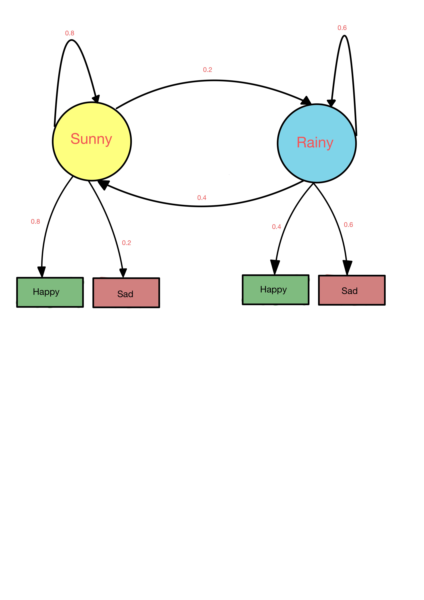
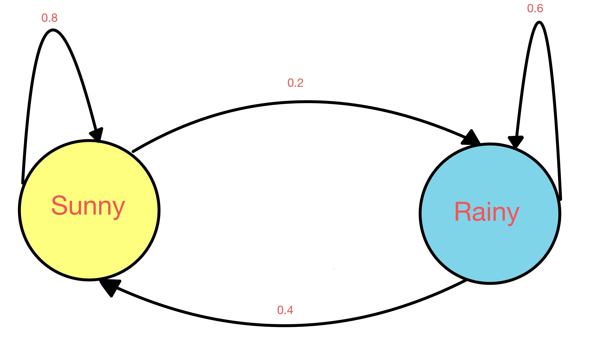
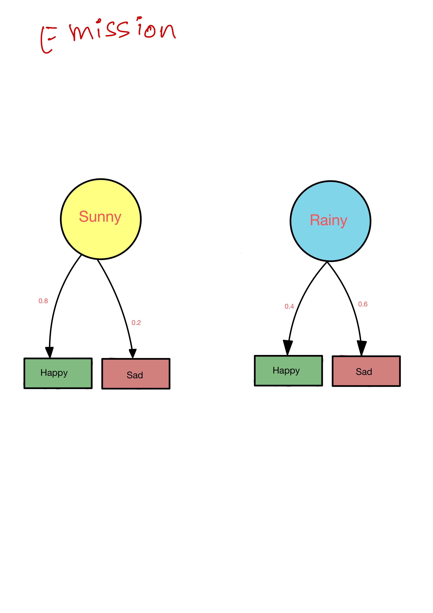
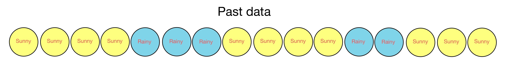
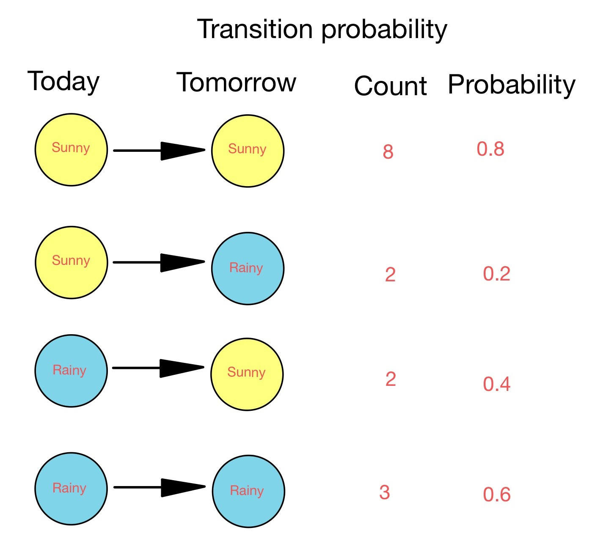
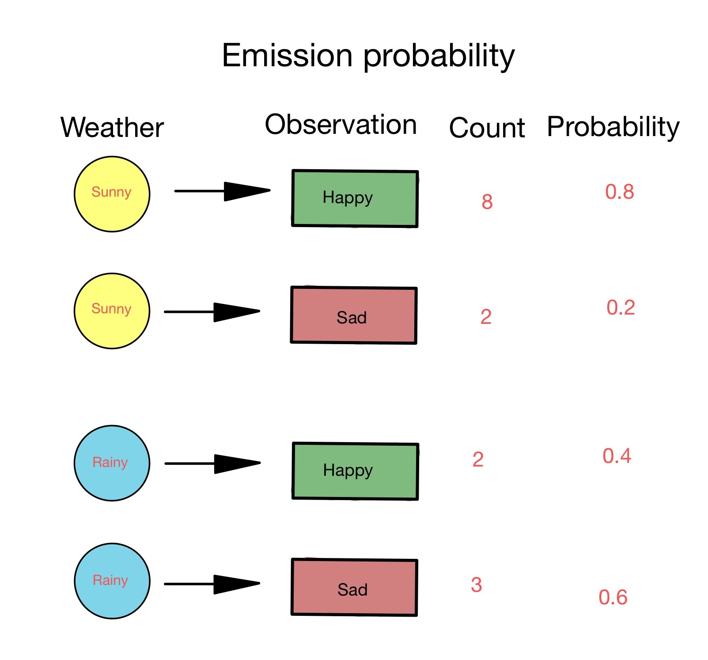

## Hidden Markov Rule

#### What is hidden markov rule (HMM)?

#### Let's take an example

- In this diagram let's say we only get to see observation and we have to predict the present state.
- The probabilities between one hidden state to another hidden state is called **transition probability**.

- The probability between states and observation is called **emission probability**.

#### Some questions?
- How do we find these probabilities?
- How to find probability that random day is sunny or rainy?
- If given output is happy today, What is the probability that it's sunny or rainy?
- If for 3 days output mood is Happy, Sad, Happy what is the weather?

#### 1. How do we find these probabilities?
From past data.

**Transition Probability**

Image shows past 15 days data arranged in order

Given this data lets calculate transition proability

**Emission Probability**

Image shows past 15 days data weather associated with mood arranged in order

Given this data lets calculate transition proability

#### 2. What is the probability of random day is sunny or rainy?
Let's say mood is not given what is the probability of sunny or rainy?

#### 3. Given that we are happy what is the probability of sunny or rainy?
IMAGE

## 4.

