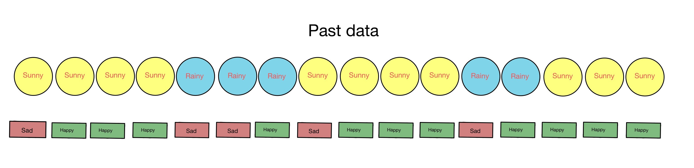
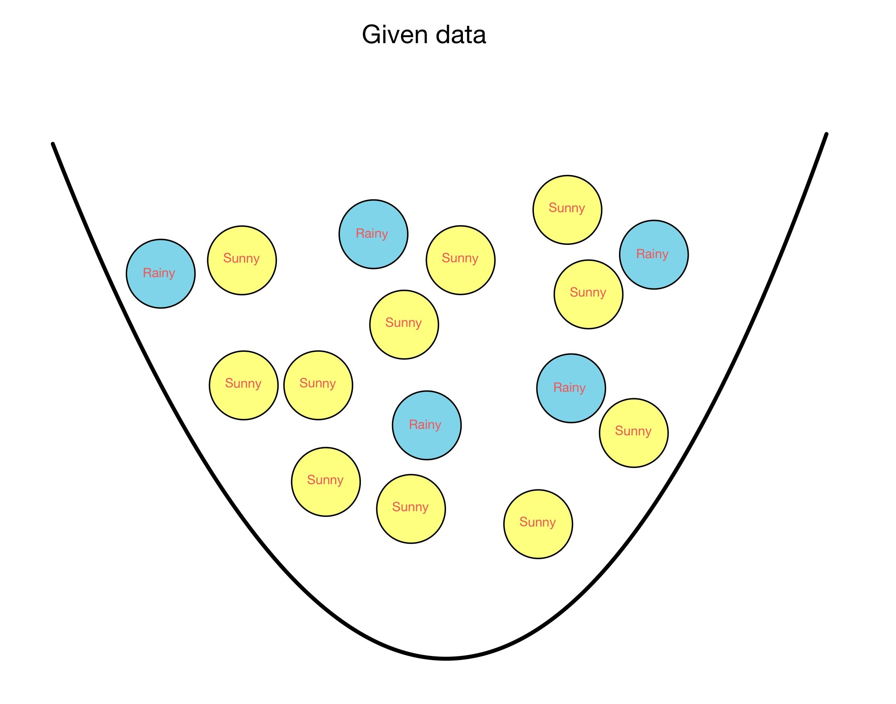
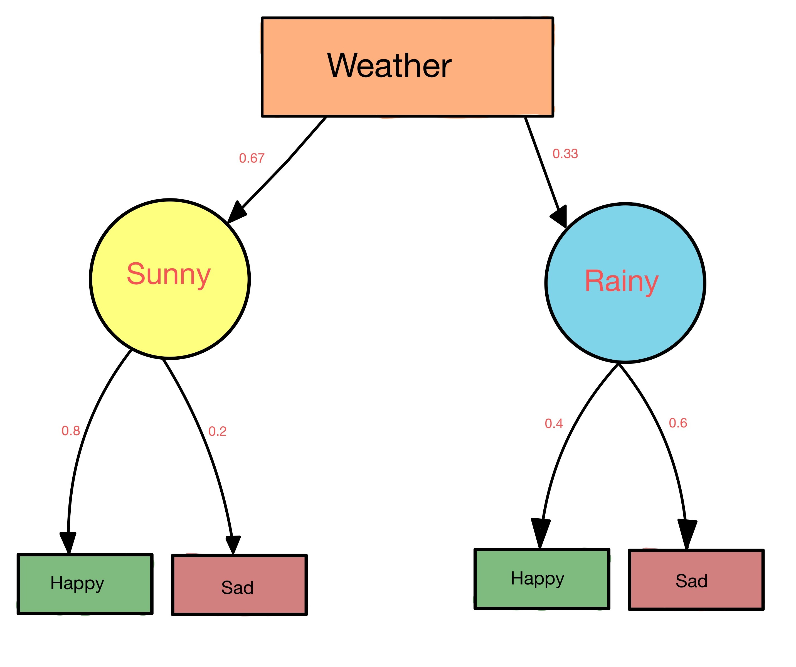
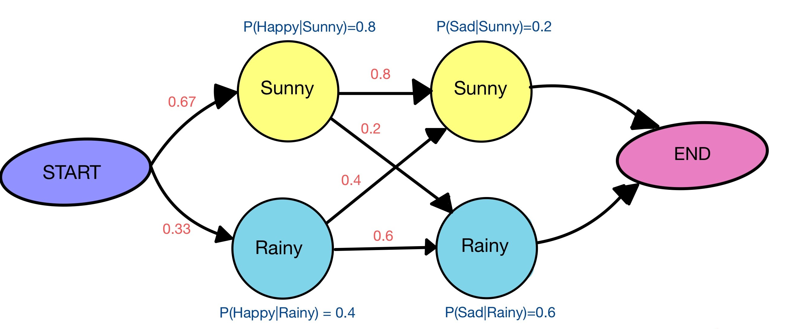
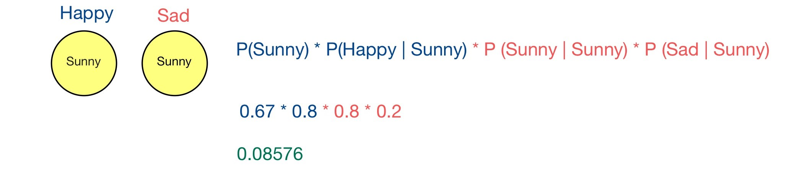
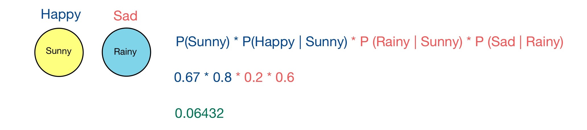
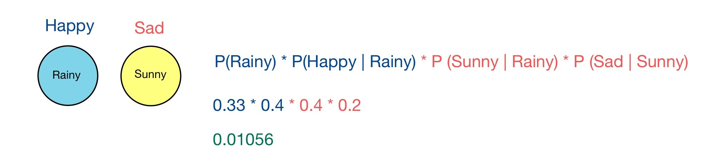
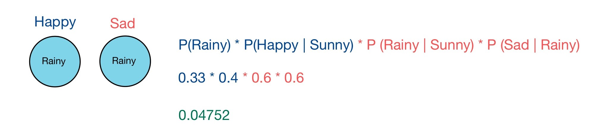
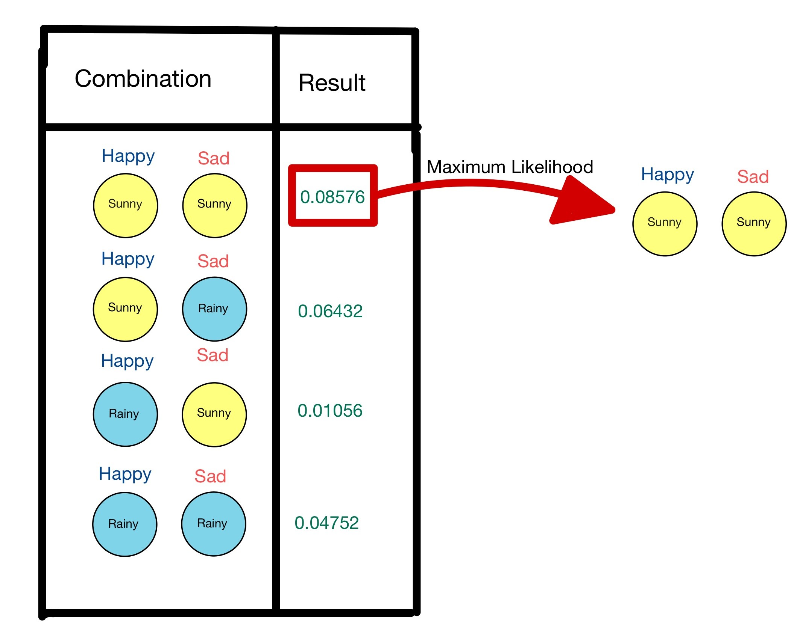

# Hidden Markov Rule

## What is hidden markov rule (HMM)?

## Let's take an example

- In this diagram let's say we only get to see observation and we have to predict the present state.
- The probabilities between one hidden state to another hidden state is called **transition probability**.

- The probability between states and observation is called **emission probability**.

## Some questions?
- How do we find these probabilities?
- How to find probability that random day is sunny or rainy?
- If given output is happy today, What is the probability that it's sunny or rainy?
- If for 2 days output mood is Happy, Sad what is the weather?

## 1. How do we find these probabilities?
From past data.

### Transition Probability

Image shows past 15 days of weather data arranged in order

Given this data lets calculate transition proability

- Given that today is **sunny** what is the probability that tomorrow will be **sunny**
$$P(Sunny|Sunny) = 0.8 $$ 
- Given that today is **sunny** what is the probability that tomorrow will be **rainy**
$$P(Rainy|Sunny) = 0.2 $$  
- Given that today is **rainy** what is the probability that tomorrow will be **sunny**
$$P(Sunny|Rainy) = 0.4 $$ 
- Given that today is **rainy** what is the probability that tomorrow will be **rainy**
$$P(Rainy|Rainy) = 0.6 $$

### Emission Probability

Image shows past 15 days of weather data associated with mood arranged in order

- Given that today is **sunny** what is the probability that tomorrow will be **sunny**
$$P(Happy|Sunny) = 0.8 $$ 
- Given that today is **sunny** what is the probability that tomorrow will be **rainy**
$$P(Sad|Sunny) = 0.2 $$  
- Given that today is **rainy** what is the probability that tomorrow will be **sunny**
$$P(Happy|Rainy) = 0.4 $$ 
- Given that today is **rainy** what is the probability that tomorrow will be **rainy**
$$P(Sad|Rainy) = 0.6 $$

Given this data lets calculate transition proability

## 2. What is the probability of random day is sunny or rainy?
- Let's say mood (happy or sad) is not given what is the probability of sunny or rainy?

$$Total Observation = 15$$

$$P(Sunny) = 10/15 = 0.67 $$

$$P(Rainy) = 5/15 = 0.33 $$

## 3. Given that we are happy what is the probability of sunny or rainy?
We know this from emisssion probability

According to the bayes theorm

$$P(Sunny|Happy) = \frac{P(Happy|Sunny) * P(Sunny)}{P(Happy)}$$

$$P(Sunny|Happy) = \frac{0.8 * 0.66}{0.66 * 0.8 **+** 0.33 * .04}$$

$$P(Sunny|Happy) = \frac{0.528}{0.528 **+** 0.132}$$

$$P(Sunny|Happy) = \frac{0.528}{0.66}$$

$$P(Sunny|Happy) = **0.80**$$

Similary,

$$P(Sunny|Sad) = **0.40**$$

$$P(Rainy|Happy) = **0.20**$$

$$P(Rainy|Sad) = **0.60**$$

## 4. If for 2 days output mood is Happy and Sad, what is the weather?
Let's look at the graph diagram, from this we can can all possible weather combination for the observation **Happy** followed by **Sad**.

**Combinatin 1:**
Sunny weather which results happiness followed by Sunny weather which results in sadness

$$P(Sunny) = 0.67$$

$$P(Happy|Sunny) = 0.8$$

$$P(Sunny|Sunny) = 0.8$$

$$P(Sad|Sunny) = 0.2$$

**Combinatin 2:**
Sunny weather which results happiness followed by Rainy weather which results in sadness

$$P(Sunny) = 0.67$$

$$P(Happy|Sunny) = 0.8$$

$$P(Rainy|Sunny) = 0.2$$

$$P(Sad|Rainy) = 0.6$$

**Combinatin 3:**
Rainy weather which results happiness followed by Sunny weather which results in sadness

$$P(Rainy) = 0.33$$

$$P(Happy|Rainy) = 0.4$$

$$P(Sunny|Rainy) = 0.4$$

$$P(Sad|Sunny) = 0.2$$

**Combinatin 4:**
Rainy weather which results happiness followed by Rainy weather which results in sadness

$$P(Rainy) = 0.33$$

$$P(Happy|Rainy) = 0.4$$

$$P(Rainy|Rainy) = 0.6$$

$$P(Sad|Rainy) = 0.6$$

**Final Result**

Answer is **Sunny** followed by **Sunny** as it gives maximum probability.

# About project

## Data
1. Brown Corpus dataset, it is stored in plain  text as a collection of words and tags
2. Each sentence starts with a unique indetifier on the first line followed by one tab seperated word 1 tag pair.

**example**

1. **setence_id1**  
      word1 : tag1  
      word2 : tag2  
      .  
      .  
      .  

2. **setence_id2**  
word1 : tag1  
word2 : tag2  
.  
.  
.  

**Brown universal dataset has**
1. 5740 sentences
2. 45872 training sentences
3. 11468 test sentences

**More about dataset**

   |               | **Total word** | **Unique Word** |
   | :-----------: |:-------------: | :-------------: |
   | **Corpus**    | 1161192        | 56057           |
   | **Training**  | 928458         | 50536           |
   | **Testing**   | 232734         | 25112           |
 
 ## Approaches
 
 ## Approach I: 
 Assign most frequent **tag** to each **word**. It is a good base line model.
 
 **Example:**
 
   | **Word**        | **Tag**     | **Count** |
   | :-----------:   |:----------: | :-------: |
   | **Will**        | Noun        | 3         |
   | **Will**        | Modal Verb  | 10        |
   
   In testing phase, **Will** will be given tag **Modal Verb** as the number of count is most
 
 ### How to build this model?
 
 1.  Create dictonary
 
            { word1: { tag1 : count, tag2 : count, .... } 
            { word2: { tag1 : count, tag2 : count, .... } 
            . 
            .
            . 
            }
            
 2. Create MFC table (Maximum frequent count table)
 
            { word1: max_count_tag,
              word2: max_count_tag, 
              . 
              . 
              . 
              }

**Result:**
 
   | **Data**           | **Accuracy**|   
   | :-----------:      |:-----------:|
   | **Training Data**  | 95.72%      |
   | **Testing Data**   | 93.01%      | 
   
### Approach 2
Hidden Markov tagger, has one hidden state and for each possible tag and parameterized by 2 probability distribution, **Emission probability** and **Transition probability.**

**Emission Probability:**
Probability of word given tag

$$P(word | tag)$$

**Transition Probability:**
Probability of next tag given current tag

$$P(tag2 | tag1)$$

 ### How to build this model?
 
 

