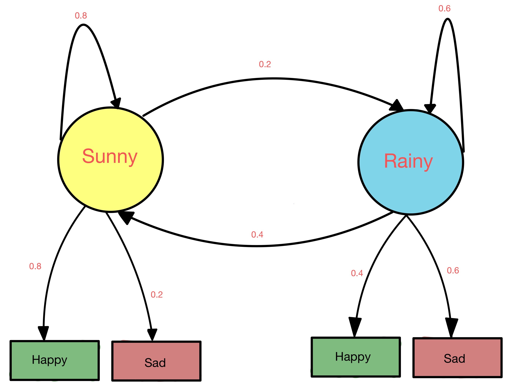
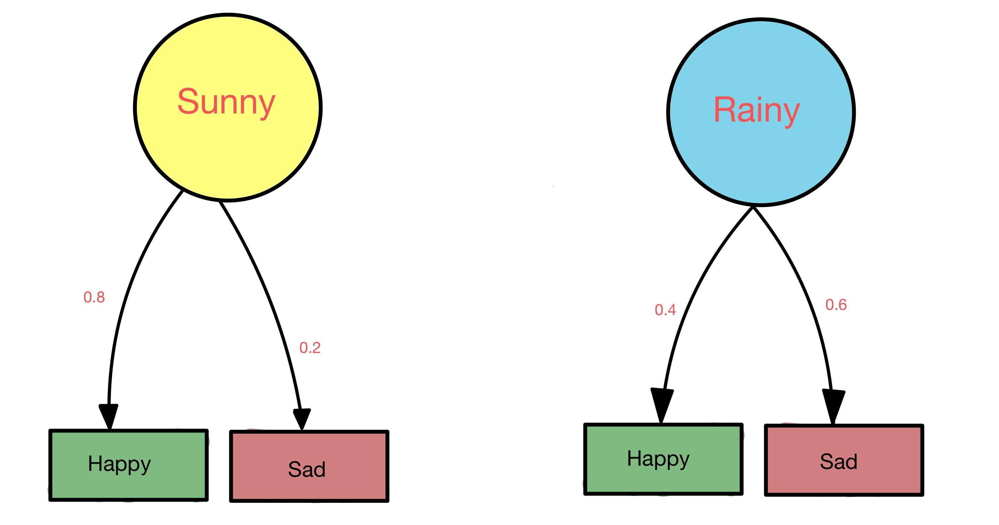

# Hidden Markov Rule

## What is hidden markov rule (HMM)?

## Let's take an example

- In this diagram let's say we only get to see observation and we have to predict the present state.
- The probabilities between one hidden state to another hidden state is called **transition probability**.

- The probability between states and observation is called **emission probability**.

## Some questions?
- How do we find these probabilities?
- How to find probability that random day is sunny or rainy?
- If given output is happy today, What is the probability that it's sunny or rainy?
- If for 3 days output mood is Happy, Sad, Happy what is the weather?

## 1. How do we find these probabilities?
From past data.

### Transition Probability

Image shows past 15 days of weather data arranged in order

Given this data lets calculate transition proability

- Given that today is **sunny** what is the probability that tomorrow will be **sunny**
$$P(Sunny|Sunny) = 0.8 $$ 
- Given that today is **sunny** what is the probability that tomorrow will be **rainy**
$$P(Rainy|Sunny) = 0.2 $$  
- Given that today is **rainy** what is the probability that tomorrow will be **sunny**
$$P(Sunny|Rainy) = 0.4 $$ 
- Given that today is **rainy** what is the probability that tomorrow will be **rainy**
$$P(Rainy|Rainy) = 0.6 $$

### Emission Probability

Image shows past 15 days of weather data associated with mood arranged in order

- Given that today is **sunny** what is the probability that tomorrow will be **sunny**
$$P(Happy|Sunny) = 0.8 $$ 
- Given that today is **sunny** what is the probability that tomorrow will be **rainy**
$$P(Sad|Sunny) = 0.2 $$  
- Given that today is **rainy** what is the probability that tomorrow will be **sunny**
$$P(Happy|Rainy) = 0.4 $$ 
- Given that today is **rainy** what is the probability that tomorrow will be **rainy**
$$P(Sad|Rainy) = 0.6 $$

Given this data lets calculate transition proability

### 2. What is the probability of random day is sunny or rainy?
- Let's say mood (happy or sad) is not given what is the probability of sunny or rainy?

$$Total Observation = 15$$

$$P(Sunny) = 10/15 = 0.67 $$

$$P(Rainy) = 5/15 = 0.33 $$

#### 3. Given that we are happy what is the probability of sunny or rainy?
We know this from emisssion probability

\frac{C(tag_1)}{N}

$$P(Sunny|Happy) = \frac{P(Happy|Sunny) * P(Sunny)}{P(Happy)}

## 4.

